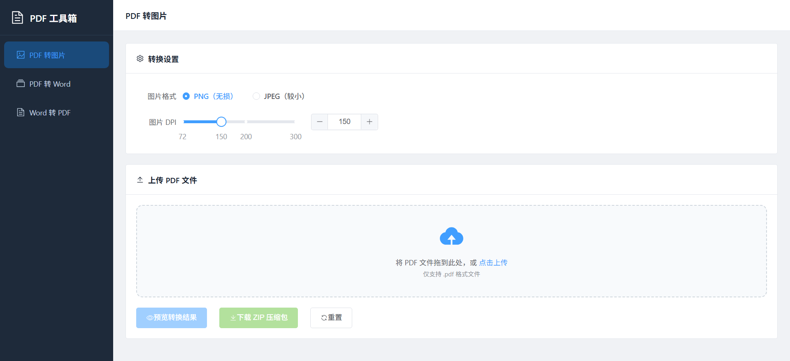
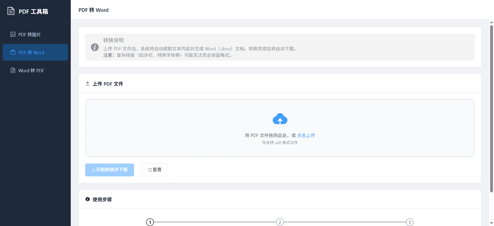
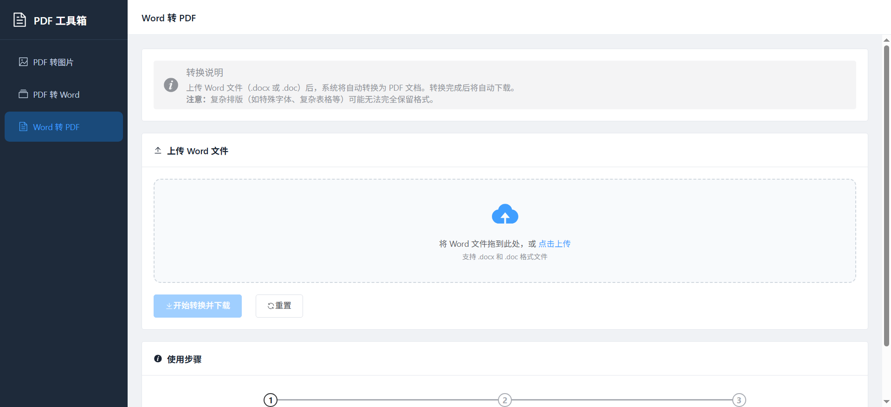

# PDF 工具箱

一个基于 Spring Boot + Vue3 的 PDF 处理工具，支持 PDF 与 Word 之间的相互转换。

## 功能特性

- **PDF 转图片**：将 PDF 文件转换为 PNG/JPEG 图片，支持预览和批量下载

- **PDF 转 Word**：将 PDF 文件转换为可编辑的 Word 文档（.docx）

- **Word 转 PDF**：将 Word 文档（.docx/.doc）转换为 PDF 文件


## 技术栈

### 后端
- **框架**：Spring Boot 3.4.12
- **JDK**：Java 17
- **PDF 处理**：Apache PDFBox 3.0.1
- **Word 处理**：Apache POI 5.2.5
- **Word 转 PDF**：XDocReport 2.0.6

### 前端
- **框架**：Vue 3.4 + Vite 5.2
- **UI 组件库**：Element Plus 2.7
- **路由**：Vue Router 4.3
- **HTTP 客户端**：Axios 1.7

## 项目结构

```
toolbox/
├── toolbox/              # 后端项目（Spring Boot）
│   ├── src/              # 源代码
│   ├── pom.xml           # Maven 配置
│   └── target/           # 构建输出
├── toolbox-ui/           # 前端项目（Vue3）
│   ├── src/              # 源代码
│   │   ├── api/          # API 接口
│   │   ├── views/        # 页面组件
│   │   ├── router/       # 路由配置
│   │   └── App.vue       # 根组件
│   ├── package.json      # NPM 配置
│   └── vite.config.js    # Vite 配置
└── README.md
```

## 快速开始

### 环境要求
- JDK 17+
- Maven 3.6+
- Node.js 18+

### 后端启动

```bash
cd toolbox
mvn spring-boot:run
```

后端服务默认运行在 `http://localhost:8080`

### 前端启动

```bash
cd toolbox-ui
npm install
npm run dev
```

前端开发服务器默认运行在 `http://localhost:5173`

### 构建部署

**后端打包**：
```bash
cd toolbox
mvn clean package
# 生成的 jar 包位于 target/toolbox-0.0.1-SNAPSHOT.jar
```

**前端打包**：
```bash
cd toolbox-ui
npm run build
# 生成的静态文件位于 dist/ 目录
```

## API 接口

| 接口 | 方法 | 描述 |
|------|------|------|
| `/api/pdf/to-images` | POST | PDF 转图片（返回 Base64） |
| `/api/pdf/to-images/download` | POST | PDF 转图片（下载 ZIP） |
| `/api/pdf/to-word` | POST | PDF 转 Word（下载 DOCX） |
| `/api/pdf/word-to-pdf` | POST | Word 转 PDF（下载 PDF） |

## 注意事项

1. 文件上传大小限制请在 `application.properties` 中配置
2. 复杂排版（多栏、特殊字体、复杂表格等）可能无法完全保留格式
3. 建议上传的文件大小不超过 50MB

## 许可证

MIT License
